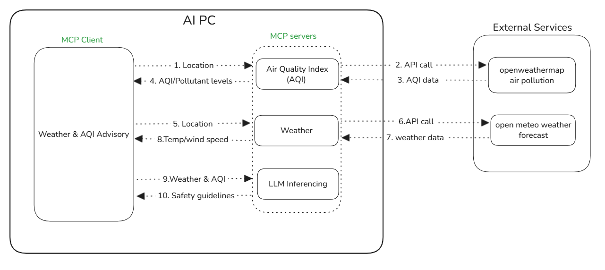

# WeatherAQI MCP Assistant
## Introduction
The sample **`WeatherAQI MCP Assistant`** is an interactive, asynchronous assistant that brings together real-time weather and AQI (Air Quality Index) data using powerful MCP (Model Context Protocol) servers.
It seamlessly connects to dedicated weather and AQI tools on **Intel® Core™ Ultra Processors** then uses [Qwen/Qwen2.5-3B-Instruct](https://huggingface.co/Qwen/Qwen2.5-3B-Instruct) to analyze the data and generate clear, actionable health and safety recommendations. The Qwen2.5-3B-Instruct model is loaded using the [**PyTorch XPU backend**](https://docs.pytorch.org/docs/stable/notes/get_start_xpu.html) to leverage Intel hardware acceleration.\
This assistant helps users stay informed about environmental conditions and make better decisions for their well-being. Designed with async operations and SSE connections, it’s perfect for modern, event-driven pipelines.

## Table of Contents

- [Sample Workflow](#sample-workflow)
- [Project Structure](#project-structure)
- [Pre-requisites](#pre-requisites)
- [Installing Prerequisites && Setting Up the Environment](#installing-prerequisites--setting-up-the-environment)
   - [For Windows](#for-windows)
   - [For Linux](#for-linux)
- [Running the Sample && execution output](#running-the-sample--execution-output)
- [Troubleshooting](#troubleshooting)
- [License](#license)
---

## Sample Workflow

This diagram illustrates how the WeatherAQI MCP Assistant operates end-to-end within an AI PC environment, combining MCP Compliant Servers, an MCP client, and external APIs.



---

## Project Structure

    WeatherAQI MCP Assistant/                                              # Project Sample folder
    ├── assets/                                                            # Assets folder which contains the images and diagrams
    │   ├── Generating_safety_guidelines_using_Pytorch_XPU.png             # Output screenshot image 1
    │   ├── WeatherAQI_MCP_Assistant_Workflow.png                          # Workflow image
    │   └── safety_measures.png                                            # Output screenshot image 2
    ├── Readme.md                                                          # Readme file which contains all the details and instructions about the project sample
    ├── weatherAQI_MCP_Assistant.ipynb                                     # Notebook file to excute the project sample
    ├── pyproject.toml                                                     # Requirements for the project sample
    └── uv.lock                                                            # File which captures the packages installed for the project sample

---

## Pre-requisites

|    Component   |   Recommended   |
|   ------   |   ------   |
|   Operating System(OS)   |   Windows 11 or later/ Ubuntu 20.04 or later   |
|   Random-access memory(RAM)   |   32 GB   |
|   Hardware   |   Intel® Core™ Ultra Processors, Intel Arc™ Graphics, Intel Graphics  |

---

## Installing Prerequisites && Setting Up the Environment

### For Windows:
To install any software using commands, Open the Command Prompt as an administrator by right-clicking the terminal icon and selecting `Run as administrator`.
1. **GPU Drivers installation**\
   Download and install the Intel® Graphics Driver for Intel® Arc™ B-Series, A-Series, Intel® Iris® Xe Graphics, and Intel® Core™ Ultra Processors with Intel® Arc™ Graphics from [here](https://www.intel.com/content/www/us/en/download/785597/intel-arc-iris-xe-graphics-windows.html)\
   **IMPORTANT:** Reboot the system after the installation.

2. **Git for Windows**\
   Download and install Git from [here](https://git-scm.com/downloads/win)

3. **uv for Windows**\
   Steps to install `uv` in the Command Prompt are as follows. Please refer to the [documentation](https://docs.astral.sh/uv/getting-started/installation/) for more information.
   ```
   powershell -ExecutionPolicy ByPass -c "irm https://astral.sh/uv/install.ps1 | iex"
   ```
   **NOTE:** Close and reopen the Command Prompt to recognize uv.
   
### For Linux:
To install any software using commands, Open a new terminal window by right-clicking the terminal and selecting `New Window`.
1. **GPU Drivers installation**\
   Download and install the GPU drivers from [here](https://dgpu-docs.intel.com/driver/client/overview.html)

2. **Dependencies on Linux**\
   Install Curl, Wget, Git using the following commands:
   - For Debian/Ubuntu-based systems:
   ```
   sudo apt update && sudo apt -y install curl wget git
   ```
   - For RHEL/CentOS-based systems:
   ```
   sudo dnf update && sudo dnf -y install curl wget git
   ```

3. **uv for Linux**\
   Steps to install uv are as follows. Please refer to the [documentation](https://docs.astral.sh/uv/getting-started/installation/) for more information.
   - If you want to use curl to download the script and execute it with sh:
   ```
   curl -LsSf https://astral.sh/uv/install.sh | sh
   ```
   - If you want to use wget to download the script and execute it with sh:
   ```
   wget -qO- https://astral.sh/uv/install.sh | sh
   ```
   **NOTE:** Close and reopen the Terminal to recognize uv.

---

## Running the Sample && execution output
   
1. In the Command Prompt/terminal, navigate to `WeatherAQI MCP Assistant` folder after cloning the sample:
   ```
   cd <path/to/WeatherAQI MCP Assistant/folder>
   ```
   
2. Log in to Hugging Face, generate a token, and download the required models and datasets:\

   `huggingface-cli` lets you interact directly with the Hugging Face Hub from a terminal. Log in to [Huggingface](https://huggingface.co/) with your credentials. You need a [User Access Token](https://huggingface.co/docs/hub/security-tokens) from your [Settings page](https://huggingface.co/settings/tokens). The User Access Token is used to authenticate your identity to the Hub.\
   Once you have your token, run the following command in your terminal.
   ```
   uv run huggingface-cli login
   ```
   This command will prompt you for a token. Copy-paste yours and press Enter.
   ```
   uv run huggingface-cli download Qwen/Qwen2.5-3B-Instruct
   ```
3. Run all MCP servers locally:\

   This sample has 3 MCP servers (runs on 3 different ports):
     - **Weather** 
     - **AQI (Air Quality Index)** 
     - **LLM Inference**
  
   To run them all, open **3 separate terminals**
  
   Terminal 1: Start the Weather MCP server
   ```
   uv run weather-server.py
   ```
   Terminal 2: Start the AQI MCP server
   ```
   uv run aqi_server.py
   ```
   Terminal 3: Start the LLM Inferencing MCP server
   ```
   uv run llm_inference_server.py
   ```
   
4. Launch Jupyter Lab and Run the notebook:\
   
   Open the [WeatherAQI MCP Assistant](./weatherAQI_MCP_Assistant.ipynb) notebook in the Jupyter Lab.
   - In the Jupyter Lab go to the kernel menu in the top-right corner of the notebook interface and choose default kernel i.e. `Python 3 (ipykernel)` from the available kernels list and run the code cells one by one in the notebook.
   ```
   uv run jupyter lab
   ```

6. GPU utilization can be seen in the Task Manager while generating safety guidelines for the requested location which are processing on Intel XPUs.
   

7. Based on the weather and AQI report in the requested location, the model generates safety guidelines.
   

---

## Troubleshooting

- **Dependency Issues:** Run `uv clean` and then `uv sync`.
- **File Access Issues:** Restart the kernel and run the cells again.

---

## License

This project is licensed under the MIT License. See [LICENSE](../LICENSE) for details.
